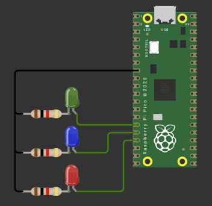

# Semáforo com leds e timers

## Circuito no Wokwi

No circuito, foram empregados: led RGB e um microcontrolador Raspberry Pi Pico W.

## Funcionamento

- A cada 3 segundos uma luz diferente do semáforo é acionada.
- As luzes são acionadas na ordem: Vermelho, Amarelo/Azul, Verde.
- Um log indicando o estado do semáforo é enviado a cada 1 segundo pela entrada serial USB.

# Código

No código foram utilizados timers de repetição para que o estado do semáforo seja modificado a cada 3 segundos. Ver comentários do código para mais explicações.

## Ferramentas Utilizadas no Desenvolvimento

- VS Code
- Wokwi
- Linguagem C
- Kit de desenvolvimento de Software Pico (Pico SDK)

## Execução do projeto

Para executar o projeto é necessário: 
- Baixar os arquivos deste repositório
- Utilizando a extensão do Wokwi para VS Code é possível simular o circuito
- Ou, utilizando a extensão Pi Pico para VS Code é possível compilar e carregar o circuito em um microcontrolador Pi Pico W
